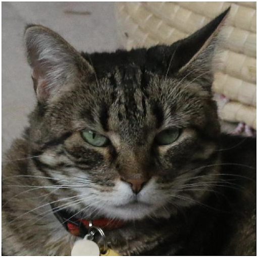
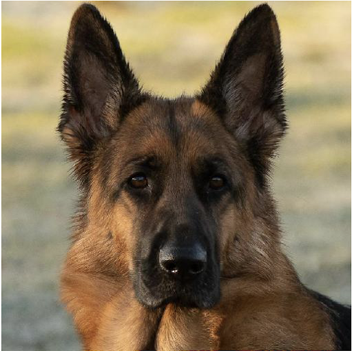
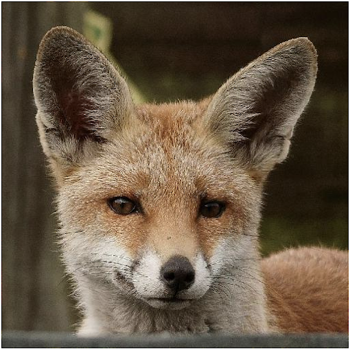
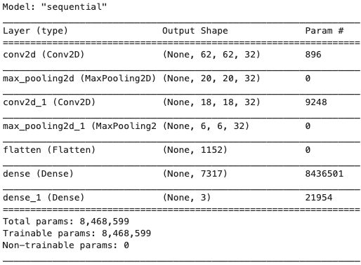
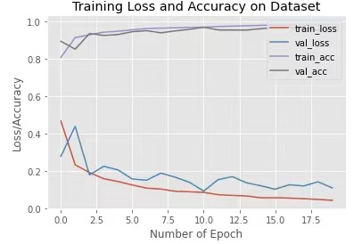
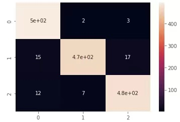

# USF-Deep-Learning-Project

# Authors: Wei He, Isabella Zhai
## The goal of this porject is to conduct an exploration of some basic deep learning techniques for object detection and classification tasks. Specifically, we would love to apply deep learning to do image classification for animal pictures. The intention of this page this to provide a general overview of this project, the steps we took, as well as the modeling outcome.

# Outline
1. Introduction 
  1.1 Goal and Overview 
  1.2 Dataset 
2. Modeling 
  2.1 CNN 
  2.2 Model Performances 
3. Conclusion  

# Introduction
### Goal And Overview
The goal of this project is to explore the basics of image detections and apply deep learning techniques to classify animal images into different categories. Why we do this? Because animals (especially cats) are cute! Before the modeling, we included a step of data augmentations on the original animal dataset in order to increase the amount of data by adding slightly modified copies of already existing data or newly created synthetic data from existing data. It acts as a regularizer and helps reduce overfitting when training a machine learning model. We then applied a CNN model on our image dataset using Tensorflow. We picked Tensorflow instead of Pytorch because both of the team member felt that the former one had easier UI to work with.  

### Dataset
We found online a nice image dataset with many cute animal faces. Below are some examples:  
#### Here is a cat  
  
#### Here is a dog  
  
#### Here is a fox  
  
There are three main animal categories within this dataset: cat, dog, and wildlife. Animals other than dog or cat (such as a fox) is classified as a wildlie. We are using around 15,000 images for training and around 1,500 images for testing the model performances. One merit of this dataset is that the images are relatively orgainzed in terms of the size. Moreover, animal face takes up the majority of an image, which in some sense should make the classification tasks easier because there is not too much noises (open filed background, legs, bodies, etc.).

# Modeling
### CNN Model
For this exploration we choose to experiment with a basic **Convolutional Neural Network (CNN)**. The summary of the model is as below: 
  
Our model has several layers. The first layer is Conv2D layer with 32 filters and the size of each filter is 3*3.  We also used relu as our activation function and two linear layers at the end. Our final linear layer outputs a tensor with 1 prediction representing the catogory of the animals.
### Model Performances
We are proud to say that we have achieved preety good modeling performances. We found that the best way to understand that is through visualizations, and we have attached two images below to explain our results.
#### Loss and Accuracy
 
We can see the train loss and validation loss both decreased quickly before epoch 9. For the left epochs the validation loss tend to fluctuat up and down, but there is not apparent overfitting existing. And after epoch 20, the accuracy of the model on the test data is 96%.

#### Confusion Matrix
 
The confusion Matrix also shows almost all the classifications done by the model are correct. The identification of dogs pictures seems has the lowest accuracy. Amoung the 500 pictures of dogs in the test data set, 35 pictures are wrongly identified.

# Conclusion
This has been an overall fun journey. We both enjoyed working with this dataset of cute animal faces. One of the struggles we encountered is getting ourselves familiar with the Tensorflow UI and functionalities, but the experience turned out very rewarding and provided us a chance to pick up this new tool. We are proud that our model can work well with the pictures and rendered satisfying model performances.
